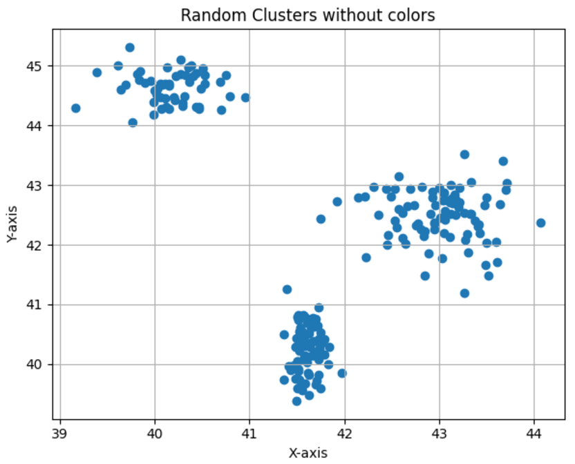
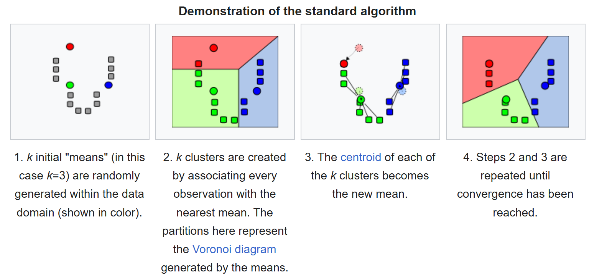

This is a test post to verify the layout and subtitle rendering.

<!--more-->

## What is K-Means? 

K-Means is a unsupervised algorithm that is capable of clustering samples very quickly 
and efficiently. Consists in partitioning the data into *k* clusters by minimizing the sum 
of squared distances between the data points and their assigned cluster centroids. 

You can clearly see three different clusters in Figure 1, which is an example of what we want k-means to do.

<figure>
  
  <figcaption>Figure 1: Clusters Example</figcaption>
</figure>

## How it works? 

### K-Means Optimization Objective

Given N examples (x₁, x₂, ..., xₙ), K-Means aims to minimize the **Sum of Squared Errors (SSE)**, also referred to as **inertia**:

$$
\text{SSE} = \sum_{j=1}^K \sum_{\mathbf{x} \in S_j} \|\mathbf{x} - \boldsymbol{\mu}_j\|^2
$$

Where:
- **μ_j** is the centroid of cluster **S_j**, calculated as:

$$
\boldsymbol{\mu}_j = \frac{1}{|S_j|} \sum_{\mathbf{x} \in S_j} \mathbf{x}
$$

### Algorithm Overview

The K-Means clustering problem is fundamentally NP-hard. To tackle this, K-Means uses an **iterative process** that alternates between the following two steps:

1. **Point Assignment**:
   Each data point is assigned to the cluster whose centroid is closest.

2. **Centroid Update**:
   The centroids are recalculated as the average position of all the points in their respective clusters.

These steps are repeated until the algorithm converges or meets a predefined stopping condition.

<figure>
  
  <figcaption>Figure 2: K-Means operates as an iterative algorithm</figcaption>
  <figcaption>Information sourced from <a href="https://en.wikipedia.org/wiki/K-means_clustering" target="_blank">Wikipedia</a></figcaption>
</figure>

## When to use K-Means?

| **Scenario**                              | **K-Means Works Well** |
|-------------------------------------------|-------------------------|
| Spherical or circular clusters            | ✅                      |
| Clusters of similar size                  | ✅                      |
| Clearly separated clusters                | ✅                      |
| Low-dimensional data                      | ✅                      |
| Clusters with similar density             | ✅                      |
| Without significant outliers              | ✅                      |
| Non-spherical clusters (e.g., L or C)     | ❌                      |
| Hierarchical or complex cluster structure | ❌                      |
| Data with many outliers                   | ❌                      |
| Clusters with different variances         | ❌                      |
| Clusters with very different sizes        | ❌                      |

## Sample Data

To experiment with the K-means algorithm, I created synthetic data. These consist of spherical clusters with 100 points each and a similar dispersion.

They were generated using `np.random.multivariate_normal`.

<figure>
  
  <figcaption>Figure 3: Generating clusters</figcaption>
</figure>

Originally, there were 8 clusters, but to make it slightly more challenging, I merged two of them, making it less straightforward for K-means.

## Poor Choices of K

### K Too Small
If we use a K far from the ideal, samples from clearly separated clusters will tend to merge, and K-means will label them within the same cluster. In this case, the correct hyperparameter \(K\) is likely \(K=6\), but if we assign \(K=4\), we can visualize the phenomenon described above.

<figure>
  
  <figcaption>Figure 4: K-means clustering with K=4</figcaption>
</figure>

### K Too Large
If we assign \(K=12\), the algorithm will force the creation of more clusters than necessary. This will result in excessive segmentation of the data, where a cohesive and well-defined cluster could be divided into several smaller clusters.

<figure>
  
  <figcaption>Figure 5: K-means clustering with K=12</figcaption>
</figure>

## The Correct K (K=6)

### Single Initialization (N_INIT=1)

With only one initialization, the result isn't very good, as it's easy to see that the cluster painted in green actually consists of two clusters. Since the function optimized by K-means is non-convex, it has several local minima. This is one of them. To find the global minimum, the algorithm should be executed multiple times with different initializations.

<figure>
  
  <figcaption>Figure 6: K-means clustering with K=6</figcaption>
</figure>

### Multiple Initializations (N_INIT=1000)

This makes much more sense. For someone unaware of the data's origin, these groups appear correct.

<figure>
  
  <figcaption>Figure 7: K-means clustering with K=6 and N_INIT=1000</figcaption>
</figure>

## Finding the Optimal K

### Inertia - Elbow Method
The **Elbow Method** helps determine the optimal number of clusters \(K\) for clustering algorithms like K-means. It involves:
- Plotting the **inertia** (sum of squared distances between data points and their cluster centroids) against \(K\).
- Identifying the "elbow point," where the decrease in inertia slows significantly.

This point suggests the optimal \(K\), balancing model accuracy and simplicity.

---

In this case, no clearly differentiated elbow can be observed.

<figure>
  
  <figcaption>Figure 8: Elbow Method with K=6 and N_INIT=1000</figcaption>
</figure>

### Silhouette Method
The **Silhouette Method** evaluates the quality of clustering by calculating the **silhouette score** for each data point:
- The score measures how similar a point is to its own cluster (cohesion) compared to other clusters (separation).
- Scores range from \(-1\) (poor clustering) to \(1\) (excellent clustering).

To use it:
- Compute silhouette scores for various \(K\) values.
- Choose the \(K\) that maximizes the average silhouette score, indicating well-separated and cohesive clusters.

---

**The Silhouette Method suggests \(K=6\), aligning with our assumption.**

<figure>
  
  <figcaption>Figure 9: Silhouette Method with K=6 and N_INIT=1000</figcaption>
</figure>

### Silhouette Plot

A **Silhouette Plot** evaluates clustering quality by showing how well data points fit their clusters:
- **Values close to 1:** Well-separated clusters.
- **Values close to 0 or negative:** Poor clustering or misclassified points.

---

We can observe that the least cohesive clusters are the brown and green ones. Additionally, in the brown cluster, at least one point has a negative silhouette score. This indicates misclassification, as it is closer to another cluster's data.

<figure>
  
  <figcaption>Figure 10: Silhouette Plot with K=6 and N_INIT=1000</figcaption>
</figure>

